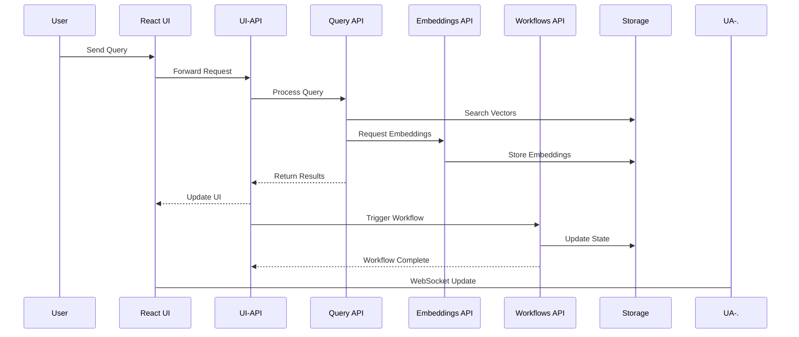
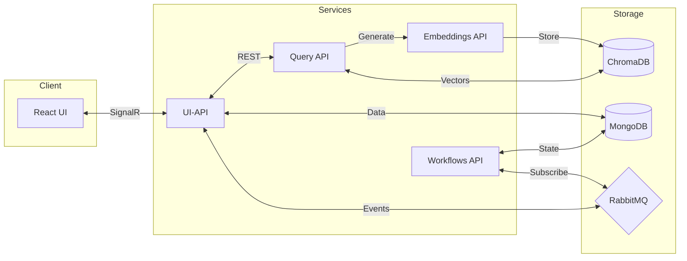
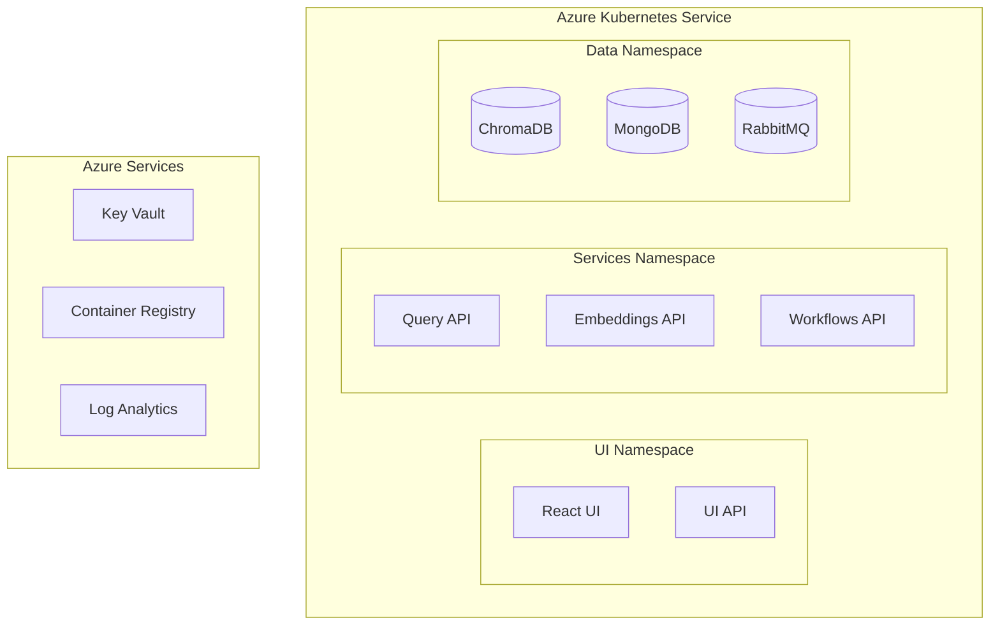

# Architecture

## System Overview

Lxi is built on a microservices architecture designed for scalability and maintainability. Each component is containerized and independently deployable.

### High-Level Architecture

## Component Details

### 1. Frontend (React/TypeScript)

- **Technology Stack**
  - React 18 with TypeScript
  - Vite for build optimization
  - Mantine UI component library
  - SignalR client for real-time updates
  - Redux Toolkit for state management
  
- **Key Features**
  - WebSocket-based real-time chat
  - Infinite scrolling message history
  - File tree visualization
  - Code syntax highlighting
  - Markdown rendering

### 2. UI-API (.NET Backend)

- **Technology Stack**
  - .NET 7 Web API
  - SignalR for real-time communication
  - Azure DevOps REST API integration
  - JWT authentication
  
- **Key Services**
  - ChatHub: Real-time message coordination
  - RepositoryService: File system operations
  - UserService: Authentication/authorization
  - NotificationService: Event broadcasting

### 3. Query API (Python FastAPI)

- **Technology Stack**
  - FastAPI framework
  - Pydantic for validation
  - AsyncIO for concurrent processing
  
- **Core Components**
  - VectorSearchEngine: Similarity matching
  - QueryProcessor: Natural language parsing
  - ResultFormatter: Response structuring

### 4. Embeddings API (Python FastAPI)

- **Technology Stack**
  - FastAPI framework
  - Hugging Face transformers
  - Git integration libraries
  
- **Key Features**
  - Async repository processing
  - Incremental updates
  - Batch embedding generation
  - Vector optimization

### 5. Workflows API (.NET)

- **Technology Stack**
  - .NET 7 Worker Service
  - Dapr actors
  - RabbitMQ integration
  
- **Core Services**
  - WorkflowOrchestrator
  - StateManager
  - EventProcessor

## Infrastructure

### Data Storage

- **ChromaDB**
  - Vector storage
  - Similarity search
  - Metadata indexing

- **MongoDB**
  - Chat history
  - User data
  - Repository metadata
  - System configuration

### Message Broker

- **RabbitMQ**
  - Event distribution
  - Service communication
  - Message persistence

### Service Mesh

- **Dapr**
  - Service discovery
  - State management
  - Pub/sub messaging
  - Secret management

### Networking

- **NGINX**
  - SSL termination
  - Load balancing
  - Static file serving
  - API routing

## Security Architecture

### Authentication

- Okta SSO integration
- JWT token validation
- Role-based access control

### Data Protection

- TLS 1.3 encryption
- At-rest encryption
- Secure secret management

## Scalability

### Horizontal Scaling

- Stateless services
- Container orchestration
- Load balancer configuration

### Performance Optimization

- Caching strategies
- Connection pooling
- Resource optimization

## Deployment Architecture

## Technology Matrix

| Component | Technology | Version | Purpose |
| -------- | ------- | -------- | ------- |
| UI | React | 18.x | Frontend application |
| UI-API | .NET | 7.0 | Backend gateway |
| Query API | FastAPI | 0.100.x | Query processing |
| Embeddings API | FastAPI | 0.100.x | Vector embeddings |
| Workflows API | .NET | 7.0 | Process orchestration |
| Vector Store | ChromaDB | Latest | Embedding storage |
| Document Store | MongoDB | 6.0 | Application data |
| Message Bus | RabbitMQ | 3.12 | Event messaging |
