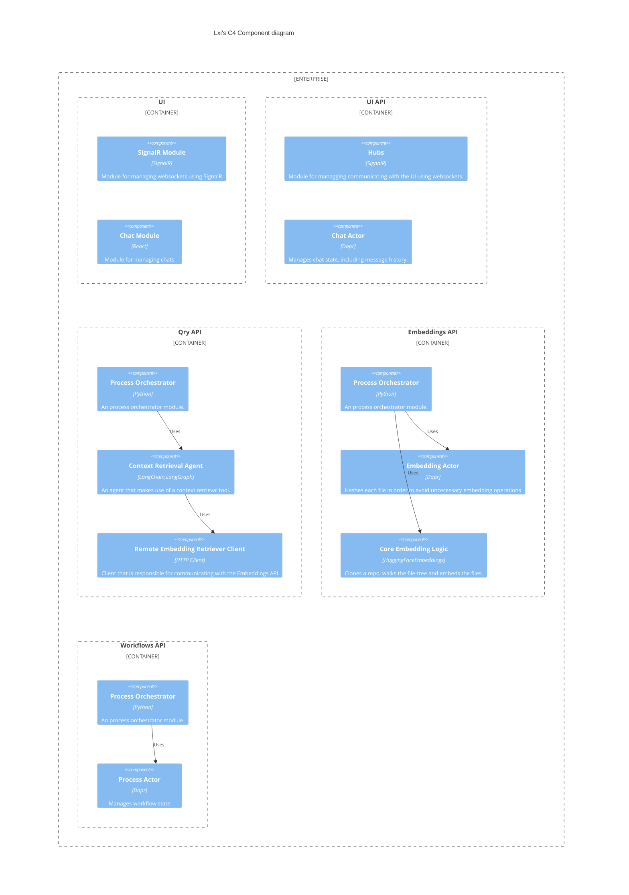

# C4 Component Diagram

```mermaid
C4Component
    title Lxi's C4 Component diagram

    Enterprise_Boundary(b0, "") {

        Container_Boundary(ui, "UI") {
            Component(signalRMod, "SignalR Module", "SignalR", "Module for managing websockets using SignalR")
            Component(chatMod, "Chat Module", "React", "Module for managing chats")
        }

        Container_Boundary(uiAPI, "UI API") {
            Component(hubs, "Hubs", "SignalR", "Module for managging communicating with the UI using websockets.")
            Component(chatActor, "Chat Actor", "Dapr", "Manages chat state, including message history.")
        }

        Container_Boundary(qryAPI, "Qry API") {
            Component(qryProcs, "Process Orchestrator", "Python", "An process orchestrator module.")
            Component(agent, "Context Retrieval Agent", "LangChain,LangGraph", "An agent that makes use of a context retrieval tool.")
            Component(retrievers, "Remote Embedding Retriever Client", "HTTP Client", "Client that is responsible for communicating with the Embeddings API")

            Rel(qryProcs, agent, "Uses")
            Rel(agent, retrievers, "Uses")
        }

        Container_Boundary(embeddingsAPI, "Embeddings API") {
            Component(embeddingsProcs, "Process Orchestrator", "Python", "An process orchestrator module.")
            Component(embeddingActor, "Embedding Actor", "Dapr", "Hashes each file in order to avoid uncecessary embedding operations")
            Component(embed, "Core Embedding Logic", "HuggingFaceEmbeddings", "Clones a repo, walks the file-tree and embeds the files.")

            Rel(embeddingsProcs, embeddingActor, "Uses")
            Rel(embeddingsProcs, embed, "Uses")
        }

        Container_Boundary(workflowsAPI, "Workflows API") {
            Component(workflowProcs, "Process Orchestrator", "Python", "An process orchestrator module.")
            Component(procActor, "Process Actor", "Dapr", "Manages workflow state")

            Rel(workflowProcs, procActor, "Uses")
        }
    }
```