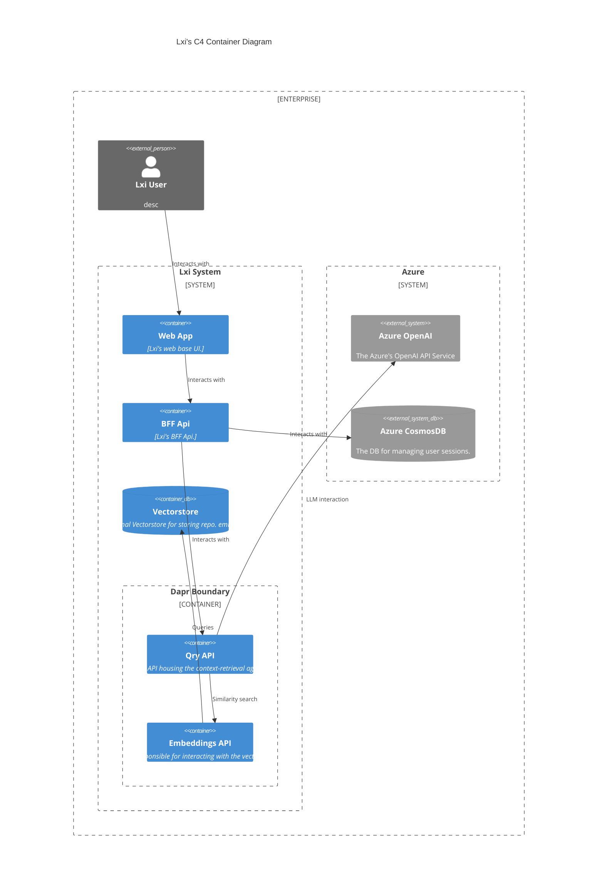

# C4 Container Diagram

```mermaid
C4Container
  title Lxi's C4 Container Diagram

  Enterprise_Boundary(b0, "") {

    Person_Ext(user1, "Lxi User", "desc")

    System_Boundary(lxiBoundary, "Lxi System") {

      Container(webClient, "Web App", "Lxi's web base UI.")
      Container(bffApi, "BFF Api", "Lxi's BFF Api.")

      ContainerDb(vectorStore, "Vectorstore", "The internal Vectorstore for storing repo. embeddings.")

      Container_Boundary(daprBoundary, "Dapr Boundary") {
        Container(qryApi, "Qry API", "The API housing the context-retrieval agent.")
        Container(embeddingsApi, "Embeddings API", "The responsible for interacting with the vectorstore.")
      }
    }

    System_Boundary(azureBoundary, "Azure") {
      System_Ext(azureOpenAI, "Azure OpenAI", "The Azure's OpenAI API Service")
      SystemDb_Ext(azureCosmosDB, "Azure CosmosDB", "The DB for managing user sessions.")
    }
  }

  Rel(user1, webClient, "Interacts with")
  Rel(webClient, bffApi, "Interacts with")
  Rel(bffApi, azureCosmosDB, "Interacts with")
  Rel(bffApi, qryApi, "Interacts with")
  Rel(qryApi, azureOpenAI, "LLM interaction")
  Rel(qryApi, embeddingsApi, "Similarity search")
  Rel(embeddingsApi, vectorStore, "Queries")
```