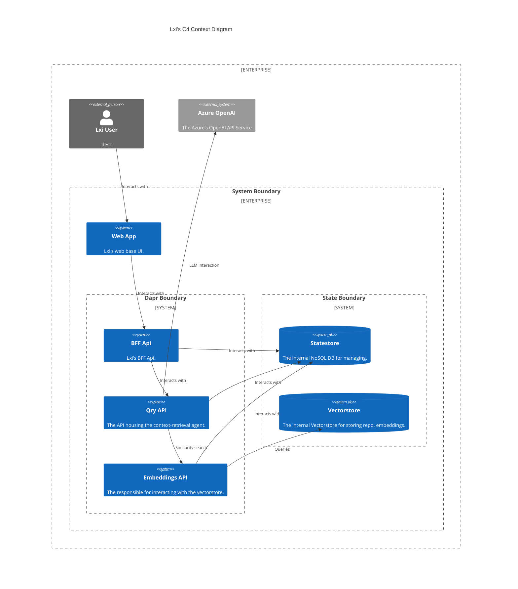

# C4 System Context Diagram

```mermaid
C4Context
  title Lxi's C4 Context Diagram

  Enterprise_Boundary(b0, "") {
    Person_Ext(user1, "Lxi User", "desc")

    Enterprise_Boundary(b1, "System Boundary") {

      System(webClient, "Web App", "Lxi's web base UI.")

      System_Boundary(b2, "Dapr Boundary") {
        System(bffApi, "BFF Api", "Lxi's BFF Api.")
        System(qryApi, "Qry API", "The API housing the context-retrieval agent.")
        System(embeddingsApi, "Embeddings API", "The responsible for interacting with the vectorstore.")
      }

      System_Boundary(b3, "State Boundary") {
        SystemDb(statestore, "Statestore", "The internal NoSQL DB for managing.")
        SystemDb(vectorStore, "Vectorstore", "The internal Vectorstore for storing repo. embeddings.")
      }
    }

    System_Ext(azureOpenAI, "Azure OpenAI", "The Azure's OpenAI API Service")
  }

  Rel(user1, webClient, "Interacts with")
  Rel(webClient, bffApi, "Interacts with")
  Rel(bffApi, qryApi, "Interacts with")
  Rel(qryApi, azureOpenAI, "LLM interaction")
  Rel(qryApi, embeddingsApi, "Similarity search")
  Rel(embeddingsApi, vectorStore, "Queries")

  Rel(bffApi, statestore, "Interacts with")
  Rel(qryApi, statestore, "Interacts with")
  Rel(embeddingsApi, statestore, "Interacts with")
```